**YES3 Exporter Documentation**

REDCap External Module  
Version 1.00, June 2022

> For better formatting and access to a Table of Contents and the Change Log, we recommend that you view this guide using the YES3 Exporter Documentation plugin link, rather than the EM documentation link provided by REDCap. 

# Introduction

The YES3 Exporter external module compliments REDCap's reports and data export tool by adding functionality to support data visualization, data sharing, and integration with statistical software and datamarts.

# Features

-   **Flexible output spreadsheet layouts** 
     -   Horizontal, vertical, and repeating form layouts
-   **Expeditiously handles large exports**
     -   Large volume exports have minimal impact on performance speed
     -   In testing it took 186 seconds to export 3,272 rows and 3,079 columns to a 33MB export csv file
-   **Enhanced data dictionary that includes metadata and data distributions** 
     -   Each export is accompanied by a customized data dictionary to simplify data sharing
-   **Detailed audit for every export download**
     -   Includes the ability to email daily activity summaries- automatically
-   **Incorporates form-specific user access and export rights**
     -   Compatible with REDCap v12 user-rights and backward compatible with earlier permissions models
-   **Supports deidentified and coded datasets** that mirror the REDCap parent system
-   **Any number of export templates may be designed and re-used**
-   **Export specifications can be rolled back and restored to a prior version**
-   **Can export directly to a host filesystem**
-   **Dark and Light themes**

# About YES3

Our vision for the Yale Study Support Suite (YES3) is to provide an ‘off-the-shelf’ suite of external modules within REDCap that features popular, high-utility software tools to meet a wide variety of clinical research needs.

# Configuration Settings

## Global Configuration

The YES3 Exporter performs daily tasks, such as removing old export backups. By default, daily housekeeping tasks are run at 11 minutes past midnight, but an administrator can specify a different time to run these tasks.

To configure, go to Control Panel -> External Modules -> Manage -> Yes3 Exporter ->Configure

## Project Configuration

Only users with project design and setup rights can configure the External Module Settings in the project.

To configure, go to External Modules -\> Manage -\> Yes3 Exporter -\>Configure

### Daily Log Report

When enabled, you can designate one email address that will receive a daily summary of export activity including: (1.) date and time of report, (2.) REDCap project information, and (3.) details about export activity in last 24 hours.

To disable the daily log report, you may change the email notification setting to “no” at any time.

### Host File System Exports

Data can be exported to a designated host file system (i.e. automounting to secure institutional file shares) which, among other things, is intended to support Datamart integration. To safeguard data security, enabling this setting requires approval by a REDCap administrator.

### Backup Retention

Export specifications (i.e. templates) can be rolled back and restored to a prior saved version. By default, 20 generations are retained.

# Overview

## Components

There are four components to the Exporter External Module.

1.  **YES3 Exporter Main**
2.  **YES3 Exporter Event Prefixes**
3.  **YES3 Exporter Logs**
4.  **YES3 Exporter Documentation**

## Appearance

The exporter was optimized for use on a standard desktop HD screen (1920 x 1080). The minimum recommended screen width, with the browser's magnification set to 100%, is 1200 pixels. You can choose between a light and dark mode in the top menu.

## Help Panel

Help Panels are identified by a **?** symbol. Help panels are located in the main menu and throughout the Exporter.

## User Rights

Users *with* project-design rights have the ability to create, modify and download exports.  Users *without* project-design rights can access what is created; they can view the export and download data.

Users will not have access to an export unless they have both **view and export** permissions. This protects the data and prevents unblinding. For those working on earlier REDCap versions, the YES3 Exporter handling of form access permissions effectively mimic the v12 form-specific exporter permissions.

If a user attempts to access an export with restricted data, they will receive the following message:

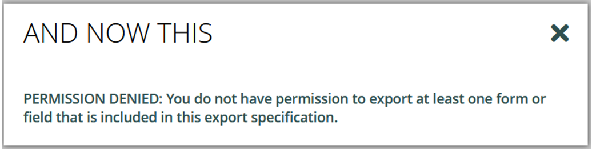

# Getting Started

In this quick start guide, you will (1.) review the prefixes, (2.) create a new export, (3.) configure settings, and (4.) download data.

## YES3 Exporter Event Prefixes

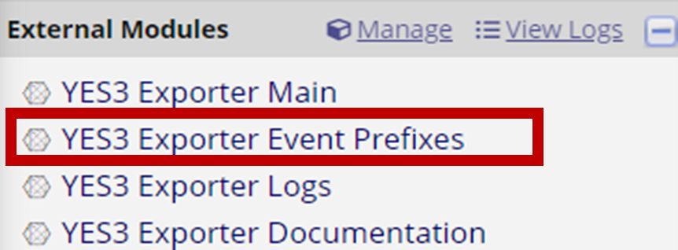

1.  Before creating your first data export, review the prefix that will be assigned to events with horizontal layouts.
2.  Access the event list by clicking the ‘**YES3 Exporter Event Prefixes’** link under **External Modules** on the left menu.
3.  You can edit the pre-generated event prefixes.
    1.  Special characters are permitted but will be removed during exports and downloads.
4.  Click save after changes are made.

## YES3 Exporter Main

### Quick Start

1.  Click  button to add a new export.

2.  Enter the export name and select a layout.

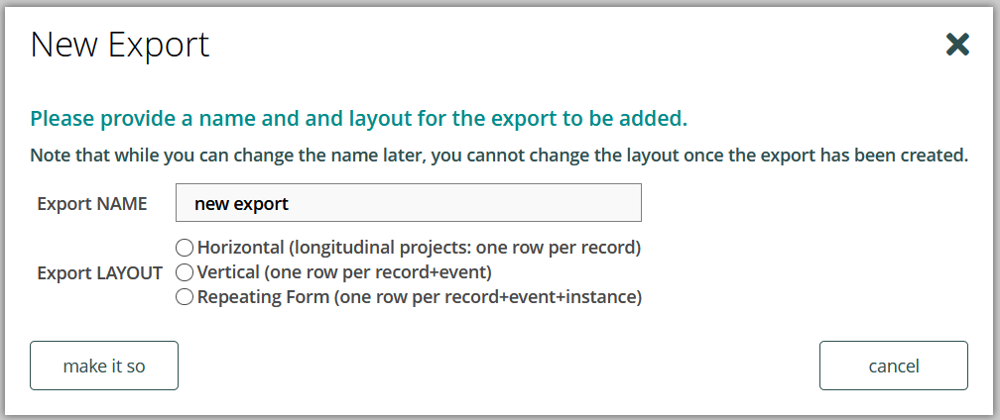

a.  Please be mindful of the following limitations when creating a new export: 
- Export names cannot be duplicated. 
- Special characters are permitted but will be removed during download.
- Create new exports judiciously. Unlike the parent system, you cannot filter, sort, or delete exports in the YES3 Exporter. 
         
3.  Once completed, click “**make it so**”.

4.  The **Export Settings** page will be displayed. Here you can customize your export.
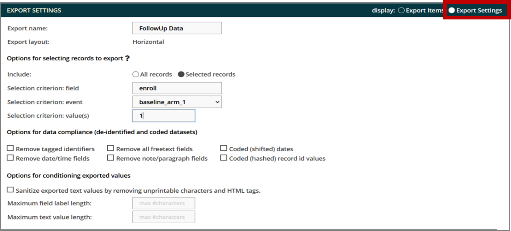

5.  Once you have selected your options, click  to save your changes.

6.  Select **'Export Items'** in the display setting to add forms/fields.

7.  Click the 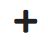 button located along the top menu to add forms/fields.

8.  <b>To add forms</b>

    a.  Select ‘Form’ for object type, then select the event and the form to add to the export.
       

      - You may choose to insert as single export item which will display as:
      
          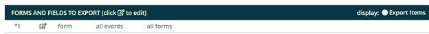  
      
      
      
      - You may choose to insert as one export item per form which will display as: 
     
          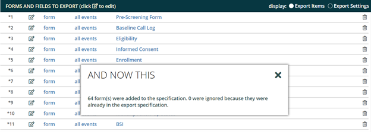 
         
         
         
      - You may choose to insert as one export item per field which will display as:
      
          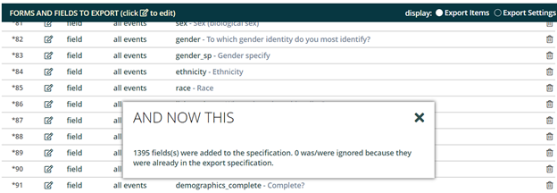 
        
     b.  Once you have chosen your display, click ‘**make it so**’.  An asterisk will appear next to each unsaved item. 
     
     c.  After you have finished adding forms to the export items, save the changes.
     
9.   <b>To add fields:</b>

     a.   Select ‘**Field**’ for object type, then select the event and type the field name.
     
     -  As you type, the field will auto-populate.
     
          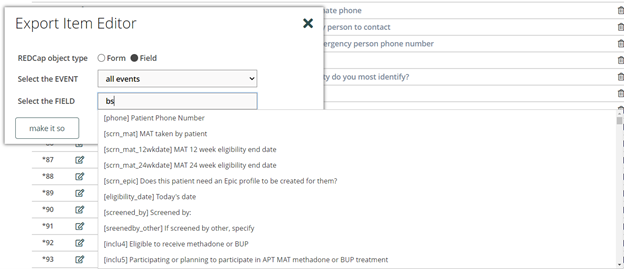 
              
      b.   Select the field that you would like to add to the export and click ‘**make it so’**.

      c.   Once you have chosen your display, click ‘**make it so**’.  An asterisk will appear next to each unsaved item. 
     
      d.   After you have finished adding fields to the export items, save the changes.

10. Click 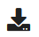 to download the data and/or data dictionary.

     **Note:** For checkbox field, the checked-off options will be combined and export into a single column.

### Export Layout

There are three export layouts:

1.  **Horizontal** 

     -  *Longitudinal projects: one row per record*
    
     -   The Exporter will automatically add prefixes to field names to differentiate data from distinct events. Prefixes can be changed in **YES3 Exporter Event                Prefixes**.
    
2.  **Vertical** 

     - *One row per record + event*
     
     - The REDCap event id is included in the data export file.
    
3.  **Repeating Form** 

     - *One row per record + event + instance*

     - Only one repeating form can be defined in the export. In this version, you cannot export repeating events.

### Export Settings View

On the Export Settings view, you can specify how data is exported across all fields. 

**Options for Selecting Records**

The selecting records option allows you to specify the field, event, and value required for inclusion in the export. This feature uses ONE field to identify the target records.

  

As an example, you may wish to restrict an export to data on those individuals who screened positive on an assessment. To optimize this feature, the target status (e.g. screen positive) must be identified through a query to ONE field in your REDCap project. Additional examples are found in the **?** icon.

**Options for Data Compliance**

The data compliance settings replicate the parent REDCap system. Removed fields will not appear in an export. No field label or placeholder will be included in the data export.

**Options for Conditioning Exported Values**

*Sanitize exported text values*

This option removes nonprintable characters including tabs, line feeds, html tags, etc. from text fields. International characters will remain intact.

*Max character length*

You can restrict the number of characters included in the export. Field labels are typically restricted to 200-250 characters to support integration with statistical programs such as SAS.

For text fields, the character restriction is applied to ALL text fields which may result in incomplete data. If you have also opted to **Remove all freetext fields**, the more restrictive specification will be followed.

### Export Items View

On the Export Items view, you can edit what data will be exported. You can make changes by using the pencil icon to edit an item or the trashcan icon to delete an item. To move an item, hover the cursor on the left side row number until a hand icon appears then drag it up or down to its new location. Remember to save your changes.

 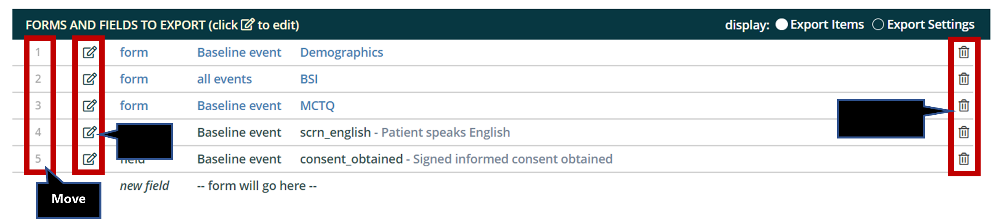 
 
 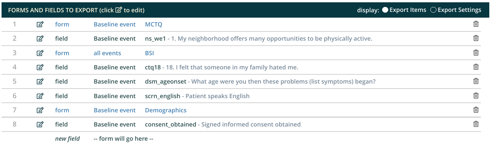 

## Exporter Data Dictionary

Each download or export is accompanied by a data dictionary that includes metadata and export-specific data distribution summaries for each column. These include the count, range, \#nonblank, and either a frequency table or mean and variance, as appropriate to the field type (dates are treated as continuous variables).

# YES3 Exporter Event Prefixes

The YES3 Exporter Event Prefixes can be accessed from the left menu panel under **External Modules**. A HELP menu is available by clicking on the **?** icon. 

 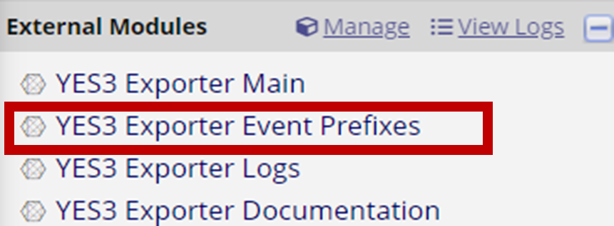 

Here you can designate event prefixes for horizontal layouts.

**[event prefix]_[REDCap field name]**

A prefix is a string of characters at the beginning of the field name that is used to designate the ‘event’. Auto-generated prefixes can be edited here. The first character must be alphabetic.  There is no restriction on the number of characters, but you should be aware of limitations imposed by statistical software. Special characters will be removed during exports and downloads.

# YES3 Exporter Logs

Here you may view and download the logs for each export that has been created. When the data is downloaded or exported, a log is generated which includes information about the export.

To use the exporter

1.  Access the export log by clicking the ‘**YES3 Exporter Logs’** link under **External Modules** on the left menu.

 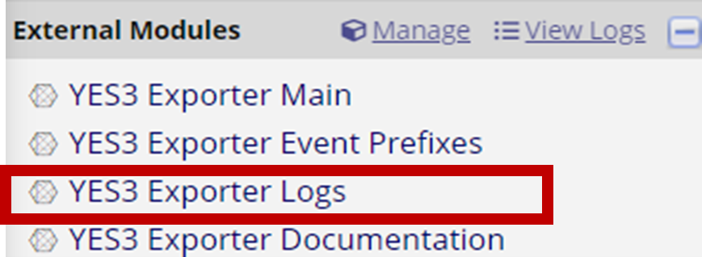 

2.  Similar to Exporter Main, a HELP menu is available by clicking on the **?** icon.

3.  Select an export to view

    a.  By default, your view will include all export activity. You may filter by user or date range.
    
    
     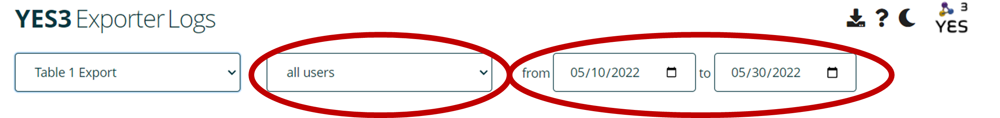 
     
    
4.  The log contains information about the exports. Detailed information can be found by clicking on the icon.

   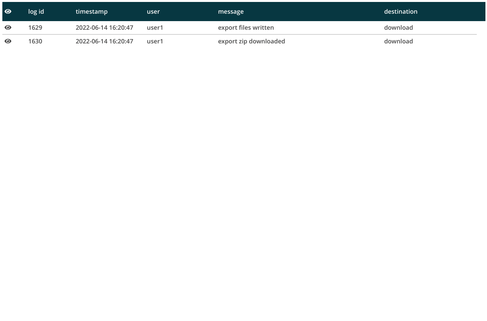

5.  Click to download the log.

   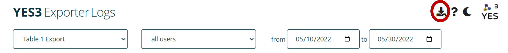 
   

**CONGRATULATIONS!- YOU MADE IT THROUGH THE READ ME FILE.**  

# Contact

redcap@yale.edu 

# In the Pipeline

-   Options for tagging, filtering, sorting, and removing exports
-   A repeating events export layout
-   Automated filesystem exports
-   Export-specific SAS and R code generators for completely automated datamarts
-   Additional YES3 modules!**NEED LINK**
    - YES3 Dashboard for data collection workflow management
    - YES3 Study Portal for single or multisite study monitoring and administration

# Authors

## Lead Designer

-   Peter Charpentier, CRI Web Tools

## Contributors

**REDCap@Yale Team:**
-   Katy Araujo, Yale University
-   Venugopal Bhatia, Yale University
-   Brian Funaro, Yale University
-   Mary Geda, Yale University
-   Janet Miceli, Yale University
-   Sui Tsang, Yale University

# Funding

-   To support our work and ensure future opportunities for development, please acknowledge the software and funding.
-   The **YES3 Exporter** was funded by Yale’s Claude D. Pepper Older Americans Independence Center (OAIC) grant through a Development Project Award for the Operations Core, **3P30AG021342**.

# License

Copyright © 2022
