**YES3 Exporter Documentation**

REDCap External Module  
Version 1.00, June 2022

# Introduction

The YES3 Exporter external module compliments REDCap's reports and data export tool by providing features optimized for automating, auditing, and maintaining datamarts.

# Features

-   **Flexible output spreadsheet layouts** including horizontal, vertical, and repeating form layouts.
-   **Expeditiously handles large exports**. Large volume exports have minimal impact on performance speed. In one benchmark it took 186 seconds to export 3,272 rows and 3,079 columns to a 33MB export csv file.
-   **Enhanced data dictionary, that includes metadata and data distributions(!)** This can drive external code generators and form the basis of basic study progress and data completion reports.
-   **Detailed audit for every download and export**. Daily activity summaries can be automatically sent to a pre-designated email address.
-   **Incorporates form-specific user export and access rights**. Compatible with the REDCap v12 form-specific export permission model, as well as with the data export model prior to version 12.
-   **Supports deidentified and coded datasets** that mirrors REDCap system data export.
-   **Any number of exports may be designed and re-used**.
    -   **Export specifications can be rolled back** and restored to a prior version.
-   **Can export directly to a host filesystem**.
-   **Dark and Light themes**.

# About YES3

Our vision for the Yale Study Support Suite (YES3) is to provide an ‘off-the-shelf’ suite of external modules within REDCap that features popular, high-utility software tools to meet a wide variety of clinical research needs.

# Configuration Settings

## Global configuration

The YES3 Exporter performs several daily tasks for each project. By default, daily tasks are run at 11 minutes past midnight, but an administrator can specify a different time to run these tasks.

To configure, go to Control Panel -\> External Modules -\> Manage -\> Yes3 Exporter -\>Configure

## Project configuration

Only users with project design and setup rights can configure the External Module Settings in the project.

## Daily Log Report

When enabled, you can designate one email address that will receive a daily summary of export activity including: (1.) date and time of report, (2.) REDCap project information, and (3.) details about export activity in last 24 hours.

To disable the daily log report, you may change the email notification setting to “no” at any time.

## Host File System Exports

Data can be exported to a designated host file system (i.e. automounting to secure institutional file shares) which, among other things, is intended to support Datamart integration. For data security, this feature requires the involvement of a REDCap administrator.

## Backup Retention

Export specifications (i.e. templates) can be rolled back and restored to a prior saved version. By default, 20 generations are retained.

# Overview

## Components

There are four components to the Exporter External Module.

1.  **YES3 Exporter Main**
2.  **YES3 Exporter Event Prefixes**
3.  **YES3 Exporter Logs**
4.  **YES3 Exporter Documentation**

## Appearance

The exporter was optimized for use on a standard desktop HD screen (1920 x 1080). The minimum recommended screen width, with the browser's magnification set to 100%, is 1200 pixels. You can choose between a light and dark mode in the top menu.

## Help Panel

Help Panels are identified by a **?** symbol. Help panels are located in the main menu and throughout the Exporter.

## User Rights

Users with project-design rights can create and modify export specifications.

Users without project design rights can view specification and export data.

Users will not have access to any exports for which they do not have both **view and export** permissions. This protects the data and prevents unblinding. For those working on earlier REDCap versions, the YES3 Exporter handling of form access permissions effectively mimic the v12 form-specific exporter permissions.

If a user attempts to access an export with restricted data, they will receive the following message:

# Getting Started

## 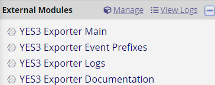YES3 Exporter Event Prefixes

1.  Before creating your first data export, review the prefix that will be assigned to events with horizontal layouts.
2.  Access the event list by clicking the ‘**YES3 Exporter Event Prefixes’** link under **External Modules** on the left menu.
3.  You can edit the pre-generated event prefixes.
    1.  Special characters are permitted but will be removed during exports and downloads.
4.  Click save after changes are made.

## YES3 Exporter Main

### Quick Start

1.  Click 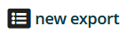 button to add a new export.
2.  Enter the export name and select a layout.

    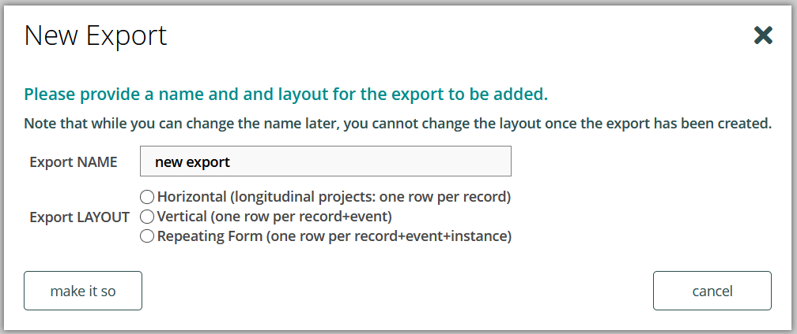

    1.  Please be mindful of the following limitations when creating a new export:
        1.  Export names cannot be duplicated.
        2.  Special characters are permitted but will be removed during exports and downloads.
        3.  The Exporter does not include a feature to filter, sort, or delete exports. Create new exports judiciously.
3.  Once completed, click “**make it so**”.
4.  The **Export Settings** page will be displayed. Here you can customize your export.
5.  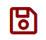Once you have selected your options, click to save your changes.
6.  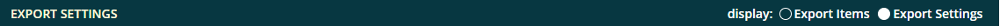Select Export Items in the display setting to add forms/fields to the export specification.
7.  Click the button located along the top menu to add forms/fields.
8.  To add form(s)
    1.  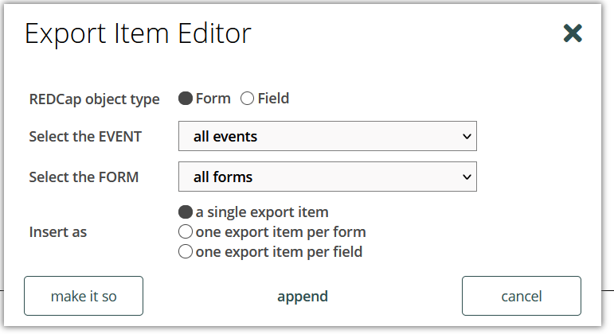 Select ‘Form’ for object type, then select the event and the form to add to the export.
        1.  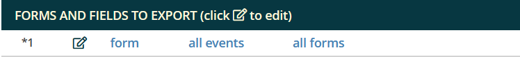You may choose to insert as single export item which will display as:
        2.  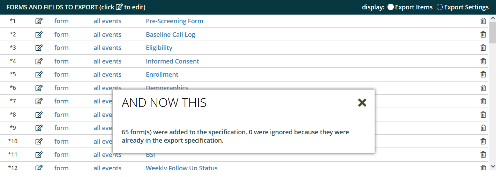You may choose to insert as one export item per form which will display as:
        3.  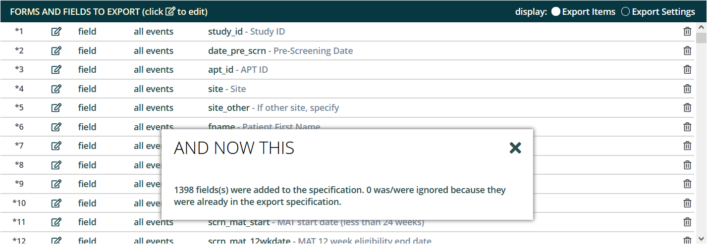You may choose to insert as one export item per field which will display as:
    2.  Once you have chosen your display, click ‘**make it so**’.
    3.  An asterisk will appear next to each unsaved item. After you have finished adding form(s) to the export items, click to save the changes.
9.  To add fields:
    1.  Select ‘**Field**’ for object type, then select the event and type the field name.
        1.  As you type, the field will auto-fill with matching text.
    2.  Select the field that you would like to add to the export and click ‘**make it so’**.

        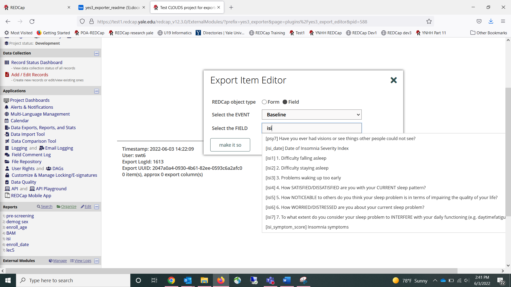

10. An asterisk will appear next to each unsaved item. After you have finished adding field(s) to the export items, click to save the changes.
11. Click  to download the data and/or data dictionary.

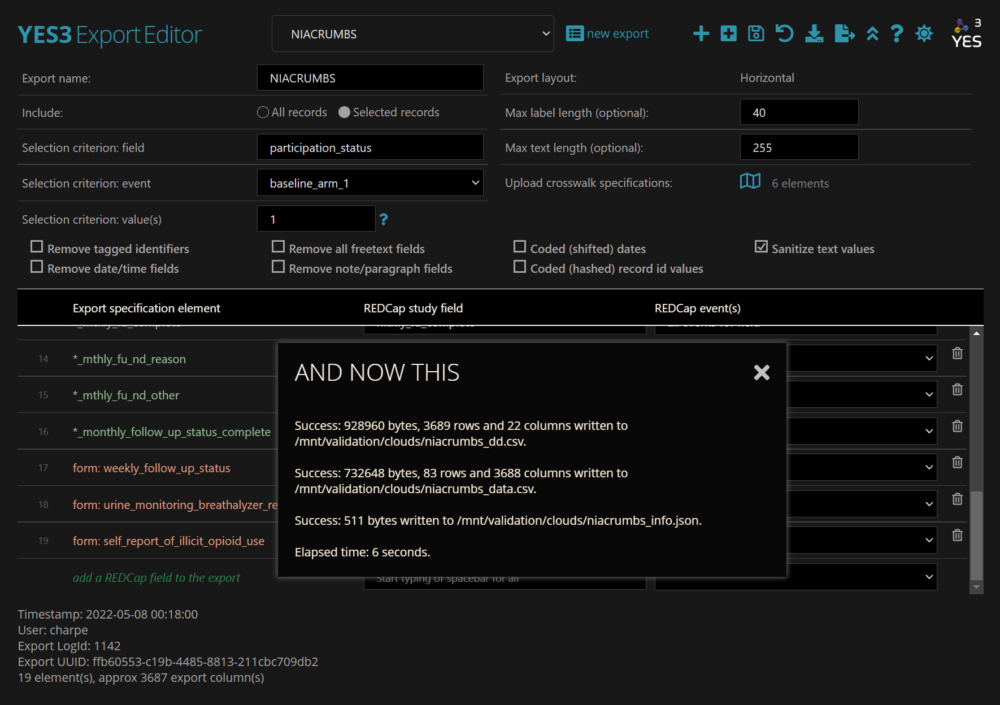

### Export Layout

There are three export layouts:

1.  Horizontal (longitudinal projects: one row per record)
    1.  The Exporter will automatically add prefixes to field names to differentiate data from distinct events. Prefixes can be changed in **YES3 Exporter Event Prefixes**.
2.  Vertical (one row per record + event)
    1.  The REDCap event id is included in the data export file.
3.  Repeating Form (one row per record + event + instance)
    1.  Only one repeating form can be defined in the export. In this version, you cannot export repeating events.

### Export Settings

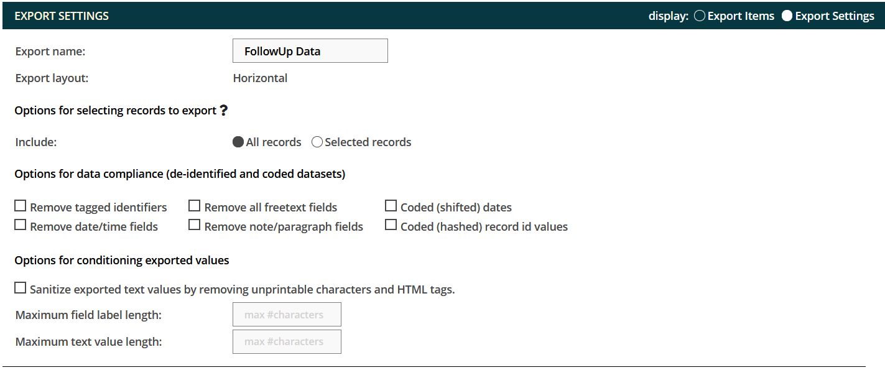

**Options for Selecting Records**

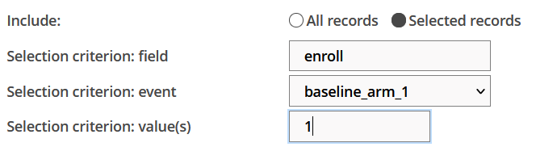The selecting records option allows you to specify the field, event, and value required for inclusion in the export. This feature uses ONE field to identify the target records.

As an example, you may wish to restrict an export to data on those individuals who screened positive on an assessment. To optimize this feature, you will need to design your project so that the target status (e.g. screen positive) can be identified by a query involving ONE field in your REDCap project. Additional examples are found in the **?** icon.

#### Options for Data Compliance

The data compliance settings replicate the parent REDCap system. Removed fields will not appear in an export. No field label or placeholder will be included in the data export.

**Options for Conditioning Exported Values**

**Sanitize exported text values**

Removes nonprintable characters including tabs, line feeds, html tags, etc. from text fields. International characters will remain intact.

**Max character length**

You can restrict the number of characters included in the export. Field labels are typically restricted to 200-250 characters to support integration with statistical programs such as SAS.

For text fields, the character restriction is applied to ALL text fields which may result in incomplete data. If you have also opted to **Remove all freetext fields**, the more restrictive specification will be followed.

### Export Items

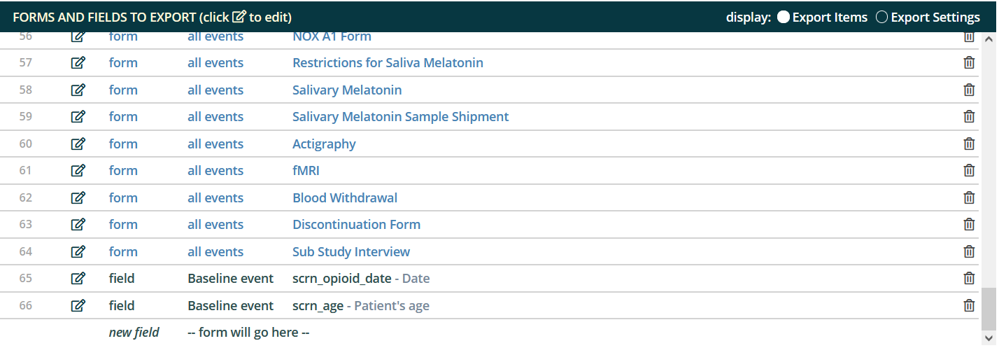On the Export Item view, you can make changes by using the pencil icon to edit an item or the trashcan item to delete an item. To move an item, Hover the cursor on the left side row number until a hand icon appears then drag it up or down to its new location. Remember to save your changes.

## Exporter Data Dictionary

Each download or export is accompanied by a data dictionary that includes metadata and export-specific data distribution summaries for each column. These include the count, range, \#nonblank, and either a frequency table or mean and variance, as appropriate to the field type (dates are treated as continuous variables).

# YES3 Exporter Event Prefixes

The YES3 Exporter Event Prefixes can be accessed from the left menu panel under **External Modules**.   
A HELP menu is available by clicking on the **?** icon.

Here you can designate event prefixes for horizontal layouts.

[event prefix]_[REDCap field name]

A prefix is a string of characters at the beginning of the field name that is used to designate the ‘event’. Auto-generated prefixes can be edited here. There is no restriction on the number of characters, but you should be aware of limitations imposed by statistical software. Special characters will be removed during exports and downloads.

# Exporter Logs

Here you may view and download the logs for each export that has been created. When the data is downloaded or exported, a log is generated which includes information about the export.

To use the exporter

1.  Access the export log by clicking the ‘**YES3 Exporter Logs’** link under **External Modules** on the left menu.
2.  Similar to Exporter Main, a HELP menu is available by clicking on the **?** icon.
3.  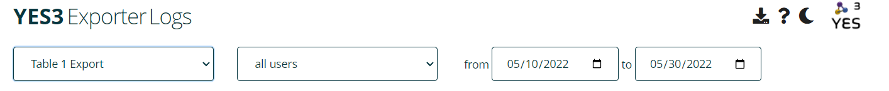Select an export to view
    1.  By default, your view will include all export activity. You may filter by user or date range.
4.  The log contains information about the exports. Detailed information can be found by clicking on the icon.

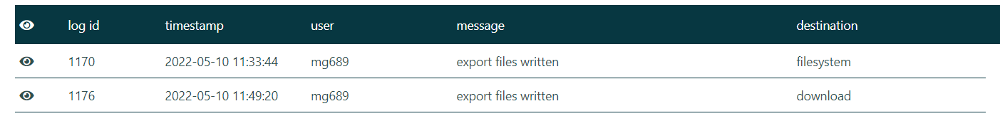

1.  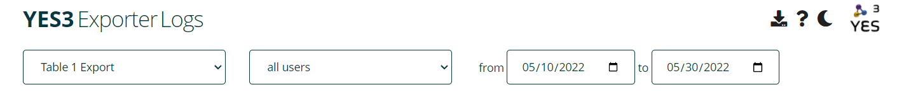Click 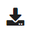to download the log.

# 

# 

# In the Pipeline

-   Ability to filter, sort, or delete exports in drop down menu
-   Ability to export repeating events
-   Automated filesystem exports

# Authors

## Lead Designer

-   Peter Charpentier, CRI Web Tools

## Contributors

-   Katy Araujo, Yale University
-   Venugopal Bhatia, Yale University
-   Brian Funaro, Yale University
-   Mary Geda, Yale University
-   Janet Miceli, Yale University
-   Sui Tsang, Yale University

# Funding

-   To support our work and ensure future opportunities for development, please acknowledge the software and funding.
-   The **YES3 Exporter** was funded by Yale’s Claude D. Pepper Older Americans Independence Center (OAIC) grant through a Development Project Award for the Operations Core, **3P30AG021342**.

# License

Copyright © 2022

# YES3 Exporter Change Log

**Version 0.7.5 May 25, 2022**

1. Bug fix: The selection criterion value "list" syntax failed with no records selected.
2. Bug fix: The selection criterion expression permitted a "=>" operator instead of ">=".
3. Added "<>" to the set of allowed operators for the selection criterion.
4. The selection criterion filter will perform numeric comparisons if the operand is numeric.
5. UI: 'labels always sanitized' note added to editor.
6. UI: The download dialog will now display a note about user data downloads being disabled, where appropriate.
7. UI: A detailed help popup is available from the form insertion panel.
8. Bug fix: It was possible to create duplicate export names in the settings editor.
9. When a backup is loaded by the wayback, a message is displayed admonishing the user to save it in order to accept the selection.
10. Confirmation is now required if you attempt to select another export while there are unsaved changes.
11. Bug fix: Invalid REDCap field names were not always handled properly after change.
12. YES3 logo added to the event preefix and log plugins.
13. Bug fix: Action icons embedded in help popups were assigned click handlers.

**Version 0.7.4 May 23, 2022**

1. Cron manager 'yes3_exporter_cron' redesigned. Now scheduled/reported in system settings instead of project settings. More consistent exception handling for cron tasks.
2. New housekeeping function 'hk_generations' to cull old export specification backups.

**Version 0.7.3 May 18, 2022**

1. Bug fix: Action icons that appeared to be disabled would under certain circumstances respond to clicks.
2. Bug fix: Opening an export spec for a repeating layout would crash if the user was denied view or export rights on any form in the project.
3. Debug help: Any Javascript error generated on one of our dev or staging hosts will now produce an onscreen report, reset the curser and shut down any modal dialogs.
4. Bug fix: the count of data values written was incorrect in the logs (double counted).
5. New plugin for displaying module markdown files, motivated by Parsedown apparently not supporting GitHub-flavored TOC tags. Uses GitHub CSS for light and dark themes, and has a sidebar TOC for navigation. Sidebar vanishes at the Bootstrap 'small' breakpoint. A vague plan is afoot to move all YES3 module documentation to a Docusaurus site.

**Version 0.7.2 May 14, 2022**

1. Yes3::ellipsis() replaced by Yes3::truncate in all metadata contexts (ellipses taking up too much space when maxlen is small)
2. Label sanitation function now strips all html tags, instead of just the 'dangerous' tags.
3. Bug fix: UTF8 characters not rendering properly in MS Excel and other apps, because of missing byte order mark (BOM)
4. Bug fix: it was possible, by blanking already-saved fields, to save an item with form or field name blank
5. Bug fix: bulk insertion was not inserting above the selected field. Fixed to act consistently with the 'paste' function, if a single field is selected when the bulk insert is activated.
6. Modal 'busy' message broadcast with 'wait' cursor style, for time-consuming AJAX processes (loading spec, saving spec, exporting data)
7. Export to host and download functions separated, with new icons.
8. Deprecated: The 'export target' setting is deprecated and no longer exposed on the UI.
9. New EM setting: if filesystem exports are enabled, user data downloads can be prevented. Data dictionary downloads are allowed.
10. Tailored and detailed non-modal help popup for selection criterion value
11. Bug fix: several issues with vertical and repeating export layouts addressed: (1) event selection was inoperable (hangover from original version that did not allow event selections for these layouts); (2) no data exported for repeat layouts; (3) column orders were not the same between data dictionary and exported data; (4) repeating layouts allowed fields from multiple forms
12. Export layout now appears as text, Instead of a disabled radio control.
13. The form insertion dialog behaves slightly differently. If you select an event when "all forms" is selected, the dropdown for "all forms" becomes those forms for which the event is configured. Any insertion will be limited to those forms.
14. The editor for the repeated layout behaves as for vertical, except that steps are taken to ensure that fields can only be selected from a single repeating form. Once you select one field or form, these constraint are applied: (1) the form insert icon is disabled and (2) the autocomplete for individual fields will include fields from that form only.
15. Hovering over a completed field input will display the REDCap field label.
