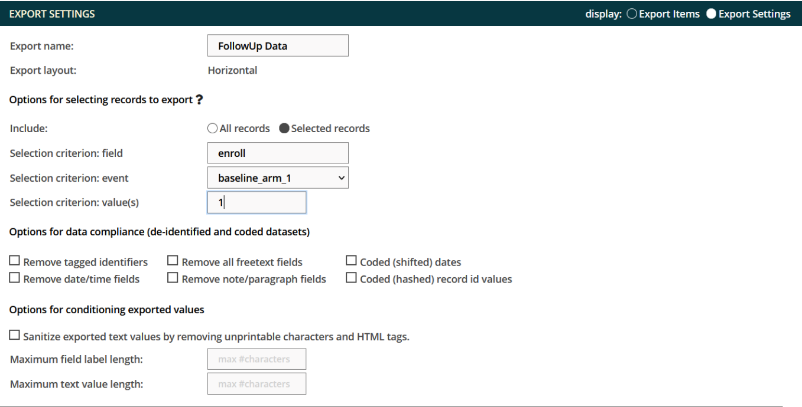
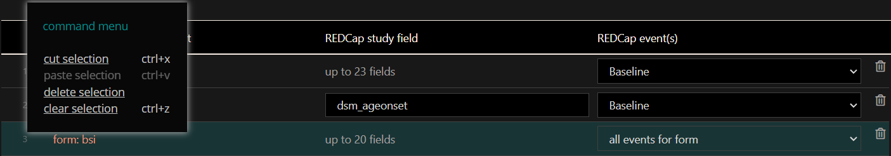

**YES3 Exporter Documentation**

REDCap External Module  
Version 1.00, June 2022

# Introduction

The YES3 Exporter external module compliments REDCap's reports and data export tool by providing features optimized for automating, auditing, and maintaining datamarts.

# Features

-   **Flexible output spreadsheet layouts** including horizontal, vertical, and repeating form layouts.
-   **Any number of export specifications may be designed and stored**.
-   **Export specifications can be rolled back** and restored to a prior version.
-   **Expeditiously handles large exports**. Large volume exports have minimal impact on performance speed. In one benchmark it took 186 seconds to export 3,272 rows and 3,079 columns to a 33MB export csv file.
-   **Enhanced data dictionary, that includes metadata and data distributions(!)** This can drive external code generators and form the basis of basic study progress and data completion reports.
-   **Detailed audit for every download and export**. Daily activity summaries can be automatically sent to a pre-designated email address.
-   **Can export directly to a host filesystem**.
-   **Incorporates form-specific user export and access rights**. Compatible with the REDCap v12 form-specific export permission model, as well as with the model.
-   **Dark and Light themes**.
-   **Supports deidentified and coded datasets** that mirrors REDCap .

# About YES3

Our vision for the Yale Study Support Suite (YES3) is to provide an ‘off-the-shelf’ suite of external modules within REDCap that features popular, high-utility software tools to meet a wide variety of clinical research needs.

# Configuration Settings

Global configuration

The YES3 Exporter performs a number of daily tasks for each project. By default, all of the daily tasks are run at 11 minutes past midnight, but administrator can specify a different time to run these tasks.

To configure, go to Control Panel -\> External Modules -\> Manage -\> Yes3 Exporter -\>Configure

Project configuration

Only users with project design and setup rights can configure the External Module Settings in the project.

## Daily Log Report

When enabled, you can designate one email address that will receive a daily summary of export activity that includes: (1.) date and time of report, (2.) REDCap host, (3.) project ID, (4.) project title, (5.) \# exports, and (6.) individual logs for each export in past 24 hours.

To disable the daily log report, you may change the email notification setting to “no” at any time.

## Host File System Exports

Data can be exported to a designated host file system (i.e. automounting to secure institutional file shares) which, among other things, is intended to support Datamart integration. As a data security safeguard, this feature requires the involvement of a REDCap administrator.

## Backup Retention

Export specifications (i.e. templates) can be rolled back and restored to a prior saved version. By default 20 generations are retained.

## 

# Overview

## Prerequisites

-   REDCap web application
-   Admin level access to Control Center to export to fileshare
-   HTML/CSS/JS/PHP

## Components

There are four components to the Exporter External Module.

1.  **YES3 Exporter Main**
2.  **YES3 Exporter Event Prefixes**
3.  **YES3 Exporter Logs**
4.  **YES3 Exporter Documentation**

## Appearance

The exporter was optimized for use on a standard desktop HD screen (1920 x 1080). The minimum recommended screen width, with the browser's magnification set to 100%, is 1200 pixels. You can choose between a light and dark mode in the top menu.

## Help Panel

You can access the Help panel at any time by clicking on the **?** icon in the Exporter menu.

## User Rights

## 

Form access- and export- rights within the REDCap project determine which exports a user may access. Users will not have access to any exports for which they do not have both **view and export** permissions. This protects the data and prevents unblinding.

If a user attempts to access an export , they will receive the following message:

For those working on earlier REDCap versions, the YES3 Exporter handling of form access permissions effectively mimic the v12 form-specific exporter permissions.

# Getting Started

## YES3 Exporter Event Prefixes

1.  Before creating your first data export, review the prefix that will be assigned to events with horizontal layouts.
2.  Access the event list by clicking the ‘**YES3 Exporter Event Prefixes’** link under **External Modules** on the left menu.
3.  You can edit the pre-generated event prefixes.
    1.  Special characters are permitted but will be removed during exports and downloads.
4.  Click save after changes are made.

## YES3 Exporter Main

### Quick Start

1.  Click  button to add a new export.
2.  Enter the export name and select a layout.

    

    1.  Export names cannot be duplicated.
    2.  Special characters are permitted but will be removed during exports and downloads.
3.  Click “Make it so”.
4.  The page will load. You can add filters to your report or other optional settings.

    

5.  Click the save button  to save your changes.
6.  
1.  
2.  
1.  
2.  
1.  
2.  
3.  
4.  
    1.  
5.  
6.  
7.  
    1.  
8.  .
1.  Click  to download the data and/or data dictionary.

### Functionality

The Exporter Main performs the critical functions which allow you to:

1.  Create a new export
2.  Review and select available exports
3.  Edit specifications
4.  Organize the export
5.  Download the data and/or data dictionary
6.  Export the data and/or data dictionary (if enabled)

#### Export Drop Down Menu

The drop-down menu displays the exports in chronological order.

**Note:** Version 1.0 does not include the ability to filter, sort, or delete exports. Please be mindful of this limitation when creating new exports.

#### Export Layout

There are three export layouts:

1.  Horizontal (longitudinal projects: one row per record)
    1.  The Exporter will automatically add prefixes to field names to differentiate data from distinct events. Prefixes can be changed in YES3 Exporter Event Prefixes.
2.  Vertical (one row per record + event)
    1.  
3.  Repeating Form (one row per record + event + instance)
    1.  Only one repeating form can be defined in the export.
    2.  In Version 1.0, you cannot export repeating events.

#### 

The **Selected records** option allows you to specify the field, event, and value required for inclusion in the export. This feature uses ONE field to identify the target records.

As an example, you may wish to restrict an export to data on those individuals who screened positive on an assessment. To optimize this feature, you will need to design your project so that the target status (e.g. screen positive) can be identified by a query involving ONE field in your REDCap project. Additional examples are found in the **?** icon.

**Max character length**

You can restrict the number of characters included in the export. Field labels are typically restricted to 200-250 characters to support integration with statistical programs such as SAS.

For text fields, the character restriction is applied to ALL text fields which may result in incomplete data so you may wish to use this option judiciously. If you have also opted to **Remove all freetext fields**, the more restrictive specification will be followed.

#### Data Protection

1.  **Remove Tagged Identifiers**- If you select this option, the exporter will remove all identifier fields tagged in your Data Dictionary during data export.
2.  **Remove date/time fields**- The REDCap designer has a field validation option for dates and times. If you select this option, the exporter will remove any fields using the date/time field validation.
3.  **Remove all freetext fields-** This will remove all free text response items (other than dates, numbers, etc.) and supersedes the max text length restriction.
4.  **Remove note/paragraph fields-** This will remove all note/paragraph fields and supersedes the max text length option.
5.  **Coded (shifted) dates**- This applies the algorithms used by the parent REDCap system to mask date fields.
6.  **Coded (hashed) record id values-** Removes record ID names and replaces with an unrecognizable value.
7.  **Sanitize text values**- Removes nonprintable characters including tabs, line feeds, html tags, etc. from text fields. International characters should remain intact.

**Note**: Removed fields will not appear in an export. No field label or placeholder will be included in the data export.

#### 

contains a list of included in the export. Export specification elements are displayed as fields (or forms) in rows in the table.

REDCap specification element may be edited using the pencil icon or trash can.

To move an item:

**** Hover the cursor near the row number on the left side until a hand appears then drag it up or down to its new location.

To re-organize, use one of the following functions:

| **To select:**               |                      |
|------------------------------|----------------------|
| One row                      | Left Click           |
| Multiple non-contiguous rows | Left Click + Control |
| Multiple contiguous rows     | Left Click + Shift   |

| **To select:**               |                      |
|------------------------------|----------------------|
| One row                      | Left Click           |
| Multiple non-contiguous rows | Left Click + Control |
| Multiple contiguous rows     | Left Click + Shift   |

Once a selection is made, right clicking will display the command menu.

## The Exporter Data Dictionary

Each download or export is accompanied by a data dictionary that includes metadata and export-specific data distribution summaries for each column. These include the count, range, \#nonblank, and either a frequency table or mean and variance, as appropriate to the field type (dates are treated as continuous variables).

# YES3 Exporter Event Prefixes

The YES3 Exporter Event Prefixes can be accessed from the left menu panel under **External Modules**.   
A HELP menu is available by clicking on the ? icon.

Here you can designate event prefixes for horizontal layouts.

[event prefix]_[REDCap field name]

A prefix is a string of characters at the beginning of the field name that is used to designate the ‘event’. Auto-generated prefixes can be edited here. There is no restriction on the number of characters, but you should be aware of limitations imposed by statistical software. Special characters will be removed during exports and downloads.

# Exporter Logs

Here you may view and download the logs for each export that has been created. When the data is downloaded or exported, a log is generated which includes information about the export.

To use the exporter

1.  Access the export log by clicking the ‘**YES3 Exporter Logs’** link under **External Modules** on the left menu.
2.  Similar to Exporter Main, a HELP menu is available by clicking on the ? icon.
3.  Select an export to view
    1.  Once selected, you may filter by user or date range. By default, your view will include all exports including all users and a date range that covers all export activity.
4.  The log contains information about the exports. Detailed information can be found by clicking on the icon.

1.  Click to download the log.

# 

# 

# In the Pipeline

-   Ability to filter, sort, or delete exports in drop down menu
-   Ability to export repeating events
-   Automated filesystem exports

# Authors

## Lead Designer

-   Peter Charpentier, CRI Web Tools

## Contributors

-   Katy Araujo, Yale University
-   Venugopal Bhatia, Yale University
-   Brian Funaro, Yale University
-   Mary Geda, Yale University
-   Janet Miceli, Yale University
-   Sui Tsang, Yale University

# Funding

-   The **YES3 Exporter** was funded by Yale’s Claude D. Pepper Older Americans Independence Center (OAIC) grant through a Development Project Award for the Operations Core, **3P30AG021342**.

# License

Copyright © 2022
