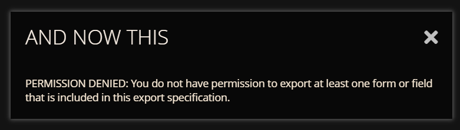
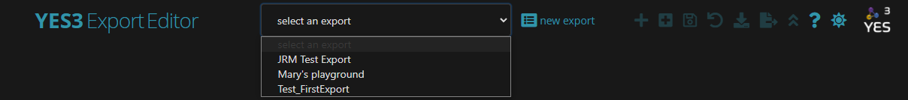
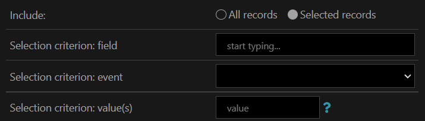

# YES3 Exporter Documentation

REDCap External Module  
Version 1.00, June 2022

## Introduction

The YES3 Exporter external module compliments REDCap's reports and data export tool by providing features optimized for automating, auditing, and maintaining datamarts.

## Features

-   **Flexible output spreadsheet layouts** including horizontal, vertical, and repeating (form) layouts.
-   **Any number of export specifications may be designed and stored**.
-   **Export specifications can be rolled back** and restored to a prior version.
-   **Expeditiously handles large exports**. Large volume exports have minimal impact on performance speed. In one benchmark it took 186 seconds to export 3,272 rows and 3,079 columns to a 33MB export csv file.
-   **Enhanced data dictionary, that includes metadata and data distributions(!)** that can drive external code generators and form the basis of basic study progress and data completion reports.
-   **Detailed audit for every download and export**. Daily activity summaries can be sent to a designated project email address.
-   **Can export directly to the host filesystem**.
-   **Incorporates form-specific user export and access rights**. The YES3 exporter is compatible with the REDCap v12 form-specific export permission model, as well as with the early "all or nothing" model.
-   **Dark and Light themes**. Full support for dark and light themes.
-   **Supports deidentified and coded datasets** that mirrors REDCap system.

## About YES3

Our vision for the Yale Study Support Suite (YES3) is to provide an ‘off-the-shelf’ suite of external modules within REDCap that features popular, high-utility software tools that can be adapted to meet a wide variety of clinical research needs. YES3 is intended to fast-track research development by providing a software foundation that supports customization by researcher-directed staff with programming & REDCap expertise; thus, maintaining flexibility while eliminating programming effort. We hope researchers will find creative ways to use YES3 to manage their studies and that future software designers can expand upon this work.

The YES3 external modules are based on software systems designed, deployed, and perfected on a series of projects over several decades involving Yale’s Claude D. Pepper Older Americans Independence Center (OAIC), under the leadership of Peter Charpentier.

YES3 development is funded through a grant 3P30AG021342-19S1**.**  It is a work in progress. Our team continues to search for funding to expand existing modules and to build out more of the suite.

### What External Modules are part of the YES3 suite?

1.  Exporter (Version 1.0, release June 2022)

YES3 is comprised of several interoperable External Modules. Although the YES3 external modules are complementary, researchers sharing and analyzing data will find the Exporter to be useful as a stand-alone tool and was chosen as our first release for YES3.

## Configuration: EM Settings

Only users with project design and setup rights have access to EM settings. Only super-users have access to the fileshare settings.

### Email Notifications- Daily Log Report

This setting allows you to designate one email address that will receive a daily summary of exporter activities.

When “yes” is selected, you will be asked to provide an email address and to specify a time to receive notifications. You are limited to one email recipient (i.e. cannot use a semi-colon to add recipients).

Summary data includes: (1.) date and time of report, (2.) REDCap host, (3.) project ID, (4.) project title, (5.) \# of exports in past 24 hours, (6.) log details (e.g. *logID, timestamp, user*) for each export in past 24 hours.

Emails are sent from the REDCap host to the designated email account. If you do not receive your daily report, check your spam/junk folder.

To disable this daily email notifications, you enter the configuration and change the email notification setting to “no”.

### Host File System Exports

Data can be exported to the host file system. This is intended to be used for automounting to secure institutional file shares and allow integration with datamarts. To ensure compliance with institutional data security and protection requirements, this requires the involvement and oversight of the REDCap host system administrator. Only super users can enable this setting and specify the host file system location.

### Specification Backup Retention

Export specifications (i.e. templates) can be rolled back and restored to a prior saved version. By default 20 generations are retained for each export specification, but you can set this count. This data is maintained within EM logs If the backup retention setting is high, performance may be impacted.

### Cron Jobs

### Caveat Emptor: Beta Features

Something here

## Getting Started

On the left-hand navigation bar under External Modules, you will see 4 components for the Exporter:

1.  **YES3 Exporter Main**
    1.  Create an export and add specifications
    2.  Edit existing exports
    3.  Export data and/or data dictionary
    4.  Download data and/or data dictionary
2.  **YES3 Exporter Event Prefixes**
    1.  For horizontal layouts, edit the prefixes assigned to column names
3.  **YES3 Exporter Logs**
    1.  Review logs of data exports
4.  **YES3 Exporter Documentation**
    1.  Link to detailed instructions

### Appearance

You can choose between a light and dark mode using the sun/moon icon located in the top menu. Theme preference will persist between browser sessions. Theme switching uses a preference strategy (localstorage "theme" setting) that is shared by other development teams.

The exporter was optimized for use on a standard desktop HD screen (1920 x 1080). The minimum recommended screen width, with the browser's magnification set to 100%, is 1200 pixels.

### Help Panel

You can access the Help panel at any time by clicking on the **?** icon in the Exporter menu.

When you first open the *Main*, *Event Prefixes*, or *Log* components of the Exporter, a Help panel will appear. The Help panel explains the icons located in the upper right menu, describes basic functions, and provides a hyperlink to the detailed instructions found here. Click “*Got it! Do not automatically display this panel again*” to prevent the panel from automatically displaying in the future.

By grabbing along the top and dragging the box, you can move the Help panel and refer to it while working.

## User Access Rights

Form access rights are combined with export rights to determine which exports a user may access. Access is denied if an export specification contains fields from forms for which the user does not have export or view permission. This extra layer of protection is to further guard against unblinding.

If a user attempts to access an existing export or add restricted data to an export to which they do not have user rights, they will receive the following message:

For earlier REDCap versions, the YES3 Exporter handling of form access permissions effectively mimics the v12 form-specific exporter permissions.

Note:

## Quick Start

To create a new export, you will be required to provide a name and layout as the minimal specifications.

## Exporter Main

The Exporter Main contains the specification editor, download function, and export function.

### Specification Editor

#### Drop Down Menu

The drop-down menu “select an export” contains the exports in chronological order.

**Note:** Version 1.0 does not include the ability to filter, sort, or delete exports. Please be mindful of this limitation when creating new exports as it may be difficult to manage long lists. Exports can be renamed and the specifications edited, but the layout (horizontal, vertical, repeating) is fixed.

#### Export Name

Export names are used to identify the export. Export names cannot be duplicated. Special characters are permitted but will be removed from export and download filenames.

Here is the file-naming convention used by the Exporter:

[export name]_data.csv – the data spreadsheet

[export name]_dd.csv – the data dictionary spreadsheet

[export name]_info.json – the information file

Export names can be changed and saved at any time.

#### Export Layout

There are three export layouts:

1.  Horizontal (longitudinal projects: one row per record)
2.  Vertical (one row per record + event)
3.  Repeating Form (one row per record + event + instance)

Choose wisely! Once an export is created, the layout cannot be changed.

##### Horizontal

If you have a longitudinal design, you may wish to use the horizontal layout, in which there is one row output per study subject and one column for each field and event combination.

The Exporter will automatically add prefixes to field names to differentiate data from distinct events. Prefixes can be changed in the YES3 Exporter Event Prefixes component.

##### Vertical

All studies can use the vertical layout, which will have one row per study subject and (if relevant) event combination, and one column for each field.

##### Repeating Form

Repeating forms can be exported using the similar repeated layout, which has one row per study subject, event, and instance combination. Only one form is permitted to be defined in the export.

**Note**: In Version 1.0, you cannot export repeating events.

#### Include: All records, Selected Records

An export can be set up to include all records in the project or selected records.

The **All records** option allows you to include all records in a project.

The **Selected records** option allows you to specify the field, event, and value required for inclusion the data export. The field name will auto populate as you type. The event options are based upon the REDCap project (inclusion of field in the event). Only one selection criterion may be used per data export. Selection criterion is limited to one event.

When creating your REDCap project, we recommend designing the project so that the status (e.g. consent, enrollment, study completion, withdrawal, etc.) can be identified from a specific field in your REDCap project. For example, you may wish to restrict a data export specification to export data on enrolled study participants.

To restrict the export to select records based on the value of the criterion field, you will use the **selection criterion: value(s)** entry. You may enter a single value, in which case only records having this value will be downloaded and/or exported. You may also enter a criterion expression to select based on a range of values.

Here are examples of valid criterion expression syntax:

-   1 - select records having a value of 1
-   3,1,4,5,9 - select records having a value of 3, 1, 4, 5 or 9
-   \< 10 - select records having a non-blank value less than 10
-   \<= 10 - select records having a non-blank value less than or equal to 10
    -   10 - select records having a non-blank value greater than 10
-   \>= 10 - select records having a non-blank value greater than or equal to 10

**string values**: if your criterion value is non-numeric, do not enclose it in quotes.

Use this: apple, table, penny,

not this: 'apple', 'table', 'penny'.

**date values**: Dates behave like strings, but you must use the format yyyy-mm-dd. For example, to select based on a date being on or after June 5, 1952 use this expression:

\>= 1952-06-05.

**Criterion field properties**: Below is a table of REDCap properties for the criterion field you have selected. Your selection criterion must be consistent with the field type and, if noted, the possible values that the field can take on.

| REDCap field name  | asi_d9_days                  |
|--------------------|------------------------------|
| REDCap field label | D9.Amphetamines past 30 days |
| REDCap field type  | text (float)                 |

#### Max label length and Max text length

You can restrict the number of characters exported for field labels or for text fields. This specification is optional.

For field labels, 200-250 is a typical character restriction for working with statistical programs such as SAS.

For text fields, the character restriction is applied to ALL text fields which may result in incomplete data so you may wish to use this option judiciously. If you have opted to **Remove all freetext fields**, the max text length will have no effect on the export as the more restrictive specification will be followed.

#### Upload Cross Specifications

#### Data Protection

As with the main REDCap export feature, you may exclude Protected Health Information (PHI), date fields and freetext fields. ID codes can be hashed and dates shifted.

#### You have the following options:

1.  Remove Tagged Identifiers- The REDCap designer allows you to tag data fields that contain identifiers. If you select this option, the exporter will remove all identifier fields tagged in your Data Dictionary during data export.
2.  Remove date/time fields- The REDCap designer has a field validation option for dates and times. If you select this option, the exporter will remove any fields using the date/time field validation.
3.  Remove all freetext fields**-** This will remove all free text response items (other than dates, numbers, etc.). This option supersedes the max text length restriction. This will not remove note/paragraph fields.
4.  Remove note/paragraph fields**-** This will remove all note/paragraph fields and supersedes the max text length option. This will not remove free text fields.
5.  Coded (shifted) dates- This uses the same algorithms as the parent REDCap system to mask date fields. When you choose to have all dates shifted, they will be shifted by a consistent length of time for each record, thus preserving the interval between dates.
6.  Coded (hashed) record id values**-** Removes record ID names and replaces with an unrecognizable value.
7.  Sanitize text values- Removes nonprintable characters including tabs, line feeds, html tags, etc. International characters should remain intact.

**Note**: Removed fields will be removed entirely. No field label or placeholder will be included in the data export.

#### Export Specification Element

The export specification table contains a list of data included in the export. Depending on how data is selected and saved the information may be displayed by individual fields, individual fields within forms, or number fields within a (entire) form.

## The Exporter Data Dictionary

Each download or export is accompanied by a data dictionary that includes metadata. The Exporter data dictionaries can drive external code generators. The data dictionary also includes export-specific data distribution summaries for each column. These include the count, range, \#nonblank, and either a frequency table or mean and variance, as appropriate to the field type (dates are treated as continuous variables). Distributional summaries may be used by datamart processes to validate data incorporated from each export. The data dictionary can be the basis of basic study progress and data completion reports.

## Exporting to the Host Filesystem

The use-case we envision for this feature is a REDCap host on which mountpoints have been configured that are directed to secure institutional fileshares. This makes it possible for exports to be written to any location deemed secure by institutional IT services. If filesystem exports are enabled for a project, data downloads can be disabled. Automated filesystem exports will be supported in the next YES3 Exporter release.

## Export Logs

Lorem ipsum dolor sit amet, consectetur adipiscing elit. Donec interdum ac odio in rhoncus. Vestibulum vel purus diam. Donec sed molestie purus, vitae vulputate nibh. Vivamus pharetra diam sit amet nulla pretium blandit. Sed malesuada, nisi ut egestas egestas, velit sem sollicitudin nibh, vitae facilisis ipsum nunc at felis. Sed et malesuada turpis. Aenean gravida diam id enim sollicitudin, nec eleifend ligula gravida. Etiam pellentesque dictum mi ac consequat. Donec sem ante, sollicitudin a blandit vel, iaculis vel massa. Mauris faucibus ligula eu eros fringilla, ac rutrum diam accumsan. Phasellus eget tortor lectus. Vivamus ultricies finibus ex. Phasellus consequat nisi vel elementum vulputate. Quisque congue vestibulum est, mollis congue arcu viverra vitae. Etiam id ligula at mauris viverra lacinia.

## What's in the Pipeline

-   Ability to filter, sort, or delete exports in drop down menu
-   Ability to export repeating events

## A Gratuitous Image

## A Gratuitous Table

|   | A  | B  | C  | D  |
|---|----|----|----|----|
| 1 | a1 | b1 | c1 | d1 |
| 2 | a2 | b2 | c2 | d2 |
| 3 | a3 | b3 | c3 | d3 |
| 4 | a4 | b4 | c4 | d4 |

# YES3 Exporter Change Log

**Version 0.7.5 May 25, 2022**

1. Bug fix: The selection criterion value "list" syntax failed with no records selected.
2. Bug fix: The selection criterion expression permitted a "=>" operator instead of ">=".
3. Added "<>" to the set of allowed operators for the selection criterion.
4. The selection criterion filter will perform numeric comparisons if the operand is numeric.
5. UI: 'labels always sanitized' note added to editor.
6. UI: The download dialog will now display a note about user data downloads being disabled, where appropriate.
7. UI: A detailed help popup is available from the form insertion panel.
8. Bug fix: It was possible to create duplicate export names in the settings editor.
9. When a backup is loaded by the wayback, a message is displayed admonishing the user to save it in order to accept the selection.
10. Confirmation is now required if you attempt to select another export while there are unsaved changes.
11. Bug fix: Invalid REDCap field names were not always handled properly after change.
12. YES3 logo added to the event preefix and log plugins.
13. Bug fix: Action icons embedded in help popups were assigned click handlers.

**Version 0.7.4 May 23, 2022**

1. Cron manager 'yes3_exporter_cron' redesigned. Now scheduled/reported in system settings instead of project settings. More consistent exception handling for cron tasks.
2. New housekeeping function 'hk_generations' to cull old export specification backups.

**Version 0.7.3 May 18, 2022**

1. Bug fix: Action icons that appeared to be disabled would under certain circumstances respond to clicks.
2. Bug fix: Opening an export spec for a repeating layout would crash if the user was denied view or export rights on any form in the project.
3. Debug help: Any Javascript error generated on one of our dev or staging hosts will now produce an onscreen report, reset the curser and shut down any modal dialogs.
4. Bug fix: the count of data values written was incorrect in the logs (double counted).
5. New plugin for displaying module markdown files, motivated by Parsedown apparently not supporting GitHub-flavored TOC tags. Uses GitHub CSS for light and dark themes, and has a sidebar TOC for navigation. Sidebar vanishes at the Bootstrap 'small' breakpoint. A vague plan is afoot to move all YES3 module documentation to a Docusaurus site.

**Version 0.7.2 May 14, 2022**

1. Yes3::ellipsis() replaced by Yes3::truncate in all metadata contexts (ellipses taking up too much space when maxlen is small)
2. Label sanitation function now strips all html tags, instead of just the 'dangerous' tags.
3. Bug fix: UTF8 characters not rendering properly in MS Excel and other apps, because of missing byte order mark (BOM)
4. Bug fix: it was possible, by blanking already-saved fields, to save an item with form or field name blank
5. Bug fix: bulk insertion was not inserting above the selected field. Fixed to act consistently with the 'paste' function, if a single field is selected when the bulk insert is activated.
6. Modal 'busy' message broadcast with 'wait' cursor style, for time-consuming AJAX processes (loading spec, saving spec, exporting data)
7. Export to host and download functions separated, with new icons.
8. Deprecated: The 'export target' setting is deprecated and no longer exposed on the UI.
9. New EM setting: if filesystem exports are enabled, user data downloads can be prevented. Data dictionary downloads are allowed.
10. Tailored and detailed non-modal help popup for selection criterion value
11. Bug fix: several issues with vertical and repeating export layouts addressed: (1) event selection was inoperable (hangover from original version that did not allow event selections for these layouts); (2) no data exported for repeat layouts; (3) column orders were not the same between data dictionary and exported data; (4) repeating layouts allowed fields from multiple forms
12. Export layout now appears as text, Instead of a disabled radio control.
13. The form insertion dialog behaves slightly differently. If you select an event when "all forms" is selected, the dropdown for "all forms" becomes those forms for which the event is configured. Any insertion will be limited to those forms.
14. The editor for the repeated layout behaves as for vertical, except that steps are taken to ensure that fields can only be selected from a single repeating form. Once you select one field or form, these constraint are applied: (1) the form insert icon is disabled and (2) the autocomplete for individual fields will include fields from that form only.
15. Hovering over a completed field input will display the REDCap field label.
